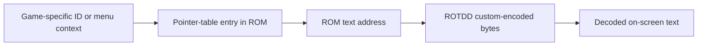

# Text Table Map

This note explains the first structured text-map export in `research/raw/text-map.csv`.

The file is meant to be machine-friendly and human-readable at the same time. It should be suitable both for research review and for future tooling.

## What it contains

The current export records four known table segments:

- `system_terms`
- `spell_names`
- `item_names`
- `class_enemy_type_names_partial`

Each row records:

- the table segment
- the local index inside that segment
- the pointer-table offset
- the resolved GBA address
- the resolved ROM offset
- decoded text
- text length
- notes that matter to the table itself, such as duplicates or partial coverage

## Confirmed item-table finding

The item display-name table is real and stable.

Examples:

- `Kenji`, `Rifle`, `Papa Doll`, `Youji`, and `Taboo Box` appear near the end of the display-name table
- `Card` and `Used Card` each appear twice in the display-name table

## Working lookup model

This is the current best model for spells and item names.

## Why the export matters

The text-map file gives us a stable handoff point between research and tooling.

- researchers can review offsets and text without decoding bytes manually every time
- tools can consume one CSV instead of scraping terminal output
- future UI work can build on a structured artifact instead of hardcoded ad hoc dumps

The CLI now also exposes the same mapped data through `list-known-text`, which is useful when you want to browse targets quickly without opening the CSV directly.

`list-known-text` can narrow the browse set by table, category, substring match, and optional notes display.

## Current editing workflow

The repo now supports safe same-length patching driven by known table rows.

The current workflow is:

1. choose an item row from `text-map.csv` or `list-known-text`
2. confirm the target string and offsets
3. prepare a replacement that encodes to the same byte length
4. patch the ROM safely with `patch-known-text`
5. verify in emulator

Longer replacements still require future repointing work.
