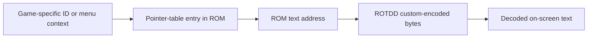

# Text Table Map

This note explains the split name-table exports that replaced the old unified text-map CSV.

The file is meant to be machine-friendly and human-readable at the same time. It should be suitable both for research review and for future tooling.

## What it contains

The current confirmed slices are:

- `character-names.csv`
- `class-names.csv`
- `enemy-names.csv`
- `item-names.csv`
- `npc-names.csv`

Each row records the compact name-table fields:

- the local index inside that segment
- the pointer-table offset
- the resolved ROM offset
- decoded text
- text length

The raw CSVs stay intentionally column-light so they are easier to scan and edit by hand. Table-specific caveats and duplicate warnings live in this writeup instead of in an extra per-row annotation column.

## Confirmed item-table finding

The item display-name table is real and stable.

Examples:

- `Kenji`, `Rifle`, `Papa Doll`, `Youji`, and `Taboo Box` appear near the end of the display-name table
- `Card` and `Used Card` each appear twice in the display-name table

## Working lookup model

This is the current best model for spells and item names.

The confirmed class-name and enemy-name slices are separate visible-name tables that live in the same general name bank after the item names.

## Why the export matters

The split name-table exports give us a stable handoff point between research and tooling.

- researchers can review offsets and text without decoding bytes manually every time
- tools can consume one CSV per entity type instead of scraping terminal output
- future UI work can build on structured artifacts instead of hardcoded ad hoc dumps

## Current editing workflow

The repo now supports safe same-length patching driven by known table rows.

The current workflow is:

1. choose an item row from `item-names.csv` or `list-item-names`
2. confirm the target string and offsets
3. prepare a replacement that encodes to the same byte length
4. patch the ROM safely with `patch-known-text`
5. verify in emulator

Longer replacements still require future repointing work.
